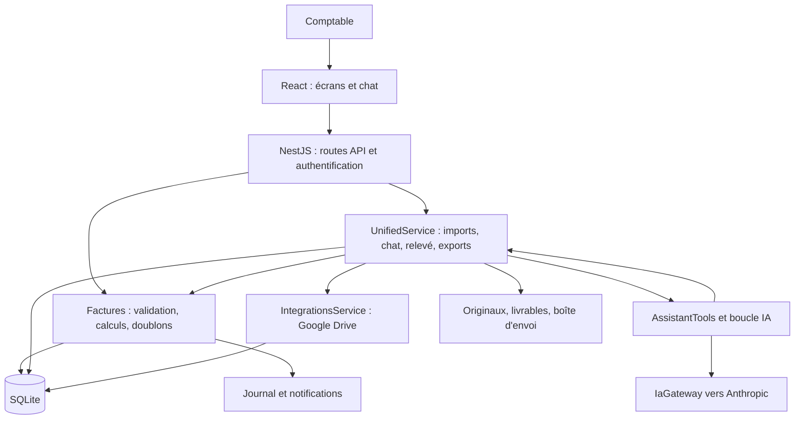
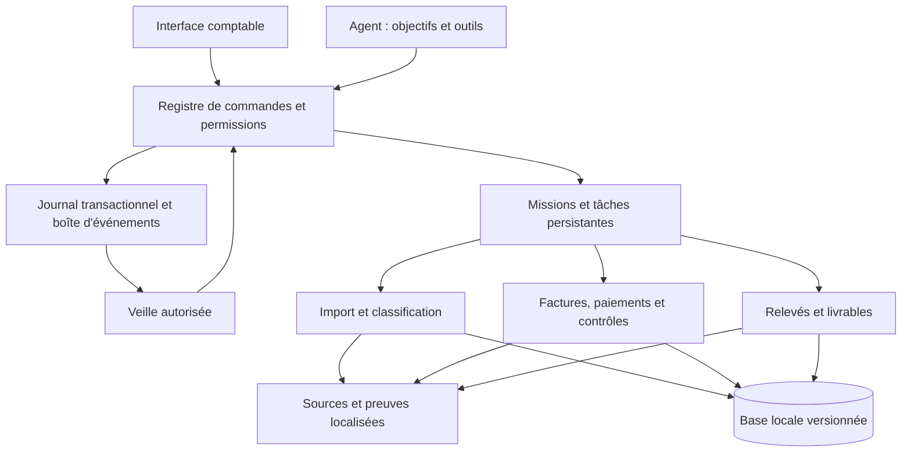
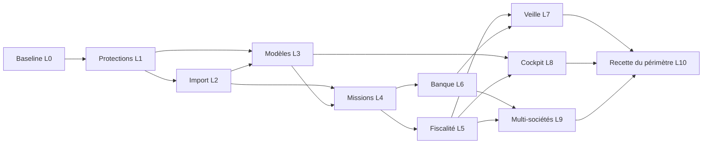

# Plan directeur Waraqa — vers une intelligence comptable complète

**Date de l’analyse : 24 septembre 2026.**
**Base examinée : version déclarée 4.5.0, branche `online-drive`, commit `b74d060`.** Le nom du dossier contient « 4.3.0 », mais les manifestes, le code et l’application lancée annoncent 4.5.0.
**Statut : diagnostic et plan de développement. Aucune des évolutions proposées ci-dessous n’est déclarée réalisée.**

## 1. Décision principale

Waraqa possède déjà un socle utile : calculs déterministes, pièces conservées, import structuré, extraction IA, conversations persistantes, actions de l’agent, rapprochements, exports, contrôle du relevé, authentification et journal. Le prochain niveau doit d’abord rendre ce socle cohérent, complet et vérifiable sur un dossier réel volumineux.

Le problème observé n’est pas seulement un assistant insuffisamment puissant. Il se situe à la jonction de cinq systèmes : compréhension du rôle des documents, qualité des données, règles métier, orchestration des opérations et restitution à l’utilisateur. Un meilleur modèle seul ne corrige ni un fichier historique importé comme achats nouveaux, ni une clôture insuffisamment protégée, ni une sauvegarde qui omet un livrable.

**Objectif produit : le comptable peut effectuer une opération dans l’interface, la demander à l’IA ou accepter sa proposition ; ces trois chemins utilisent exactement les mêmes services métier, permissions, calculs et preuves.** Une veille autorisée peut ensuite préparer des travaux, sans s’attribuer les validations réservées au comptable.

Ordre recommandé :

1. Protéger l’existant et rendre les capacités réellement présentes compréhensibles par l’assistant.
2. Séparer pièces comptables, paiements, modèles, historiques, référentiels et données d’évaluation avant toute création de lignes.
3. Fiabiliser imports, dédoublonnage et lecture des gros classeurs avec une couverture mesurable.
4. Livrer des relevés et rapports fidèles à la demande, avec provenance et présentation maîtrisées.
5. Centraliser permissions, clôtures, règles fiscales et orchestration durable.
6. Étendre progressivement rapprochement, mémoire métier, proactivité et pilotage multi-périodes.
7. Aborder le multi-sociétés et les fonctions de comptabilité générale après stabilisation du parcours principal.

## 2. Périmètre, sources et limites de cette analyse

### 2.1 Ce qui a été examiné

- Échange fourni dans `Pasted text.txt`, depuis la demande d’import du ZIP jusqu’à l’auto-diagnostic de l’assistant. Source reçue : `/home/izo/.codex/attachments/f632939f-3d3e-4381-9027-9232a0013ac7/Pasted text.txt`.
- Architecture NestJS/TypeORM/SQLite, React/Vite, contrôleurs, services métier, boucle IA, imports, export Excel/XML/PDF, Drive, sauvegarde/restauration, authentification et tests associés.
- Lecture SQLite explicite en mode `mode=ro`, par transactions de lecture, autour de 11 h 09 UTC le 24/09/2026. Les nombres sont ceux de cet état, susceptible d’évoluer pendant l’utilisation de l’application.
- Structure XML du classeur local `TVA 07 2026(2).xlsx` et du modèle embarqué, sans les modifier ni les réimporter.
- Documentation existante et présence des fichiers de tests. Les anciens résultats sont des éléments historiques, pas des tests réexécutés pendant cette analyse.

Inventaire des zones de travail :

| Zone | Fichiers trouvés | Contenu |
|---|---:|---|
| `backend/src` | 84 | 80 fichiers TypeScript, modèle XLSX, polices et licence |
| `backend/test` | 12 | 10 suites e2e, préparation des tests, configuration |
| `frontend/src` | 16 | 12 TSX, 2 TypeScript, 2 CSS |
| `scripts` | 11 | Démarrage, construction, contrôles, restauration et modèle |
| `docs` | 31 | 9 Markdown, 10 JSON, 9 images, 3 PDF |

Ces **154 fichiers** constituent les zones inventoriées, pas un décompte de tout le dépôt. L’inspection approfondie a suivi les flux critiques ; elle n’est ni une certification de chaque ligne de code, ni une recette exhaustive de tous les écrans.

### 2.2 Ce qui n’a pas été fait

Aucune modification du code, de `.env`, des dépendances, des modèles XLSX ou de la base. Aucun nouvel import du ZIP, aucune correction comptable, aucun appel IA payant, aucune connexion au lien Drive de la conversation, aucun envoi externe, aucune clôture et aucun déploiement. Le seul livrable créé pour cette demande est ce fichier Markdown.

Les règles fiscales présentes dans le code sont décrites comme **comportement logiciel actuel**, sans validation juridique nouvelle. Avant développement fiscal, un comptable doit vérifier les textes DGI applicables à l’exercice, les spécifications d’échange et les conventions réellement autorisées. Les formulations de l’IA sur les seuils, délais, régimes ou une prétendue conformité officielle ne servent pas de source normative.

### 2.3 Niveaux de preuve utilisés

| Marqueur | Signification |
|---|---|
| **Observé** | Présent dans l’échange, le fichier local ou l’état SQLite lu |
| **Code confirmé** | Chemin ou condition identifié dans les sources ; comportement pas nécessairement rejoué |
| **À reproduire** | Risque déduit du code qui exige un test isolé avant qualification définitive |
| **Cible** | Évolution proposée ; absente ou non démontrée aujourd’hui |
| **À valider métier** | Décision comptable/fiscale que le logiciel ne doit pas inventer |

## 3. Ce que montre réellement votre session

### 3.1 Réconciliation du lot de 273 entrées

Le lot stocké est `Waraqa_Jeu_de_Test_2026-08(1).zip`.

| État enregistré par entrée | Nombre | Interprétation exacte |
|---|---:|---|
| `a_verifier` | 139 | Traitement terminé sans erreur d’import enregistrée ; revue comptable encore nécessaire |
| `partiel` | 104 | Certaines lignes rejetées ; cela ne garantit pas qu’au moins une ligne ait été créée |
| `a_saisir` | 9 | Aucune ligne exploitable ; pièce conservée |
| `deja_importe` | 19 | Le contrôle documentaire a intercepté un fichier déjà connu |
| `erreur` | 2 | Échec enregistré ; original conservé |
| **Total traité** | **273** | **139 + 104 + 9 + 19 + 2 = 273** |
| Entrées supplémentaires écartées par l’extracteur | 21 | Hors compteur des 273 pièces candidates |
| **Pièces « à reprendre »** | **115** | **104 + 9 + 2 = 115**, et non 115 PDF illisibles |
| Lignes créées par le lot | 2 240 | Réparties entre plusieurs périodes et plusieurs rôles documentaires |

Les 21 exclusions enregistrées comprennent : 10 formats non pris en charge sans autre précision, 3 HEIC, 5 Word, 1 TIFF, 1 e-mail et 1 fichier vide. Un total de 294 entrées est donc **comptabilisé par le manifeste du lot** ; ce n’est pas un inventaire physique indépendant de toute l’archive, car des fichiers système sont ignorés par l’extracteur.

La base contient au moment de la lecture **2 341 lignes**, **255 documents**, **196 lignes marquées doublons**, aucune ligne revue et aucune ligne archivée. Le lot apporte 2 240 lignes ; le fichier hors lot apporte 101 lignes : **2 240 + 101 = 2 341**.

Pour août 2026, la sélection SQL selon `datePaie`, sinon `dateFac`, trouve **263 lignes**, dont **108 marquées doublons**. L’échange parle de 101 doublons écartés par le relevé : ces nombres ne doivent pas être forcés à l’égalité. Les sélections, exclusions et états peuvent différer ; le futur bilan doit exposer la période, le filtre et l’instant de calcul.

### 3.2 Le problème prioritaire : le rôle des fichiers

| Provenance enregistrée dans le nom des documents | Documents | Lignes créées | Lecture du constat |
|---|---:|---:|---|
| `07_Classeurs_EDI_TVA_historiques` | 20 | 1 817 | Des historiques ont été convertis en lignes du même espace de travail |
| `99_Verite_terrain` | 5 | 297 | Des fichiers de vérité terrain ont alimenté les données métier |
| `10_Documents_non_comptabilisables_BL_BC_Devis_Proforma` | 16 | 16 | Le rangement annoncé comme non comptabilisable n’empêche pas la création de lignes |
| `14_Referentiels` | 5 | 0 | Des référentiels sont passés dans la chaîne d’import sans produire de lignes |
| Classeur `TVA 07 2026(2).xlsx`, hors lot | 1 | 101 | Un fichier utilisé comme référence est aussi présent comme source de lignes |

Ces catégories proviennent des chemins et des métadonnées ; les noms seuls ne constituent pas une qualification comptable de chaque contenu. Elles suffisent toutefois à démontrer qu’un dépôt hétérogène n’a pas de séparation robuste entre **apprendre une structure**, **consulter un historique**, **évaluer le système** et **importer des achats**.

**Décision : aucun modèle, référentiel ou fichier de vérité terrain ne doit créer de nouvelles écritures par le simple fait d’être joint au chat.** Les anciennes lignes ne seront pas supprimées automatiquement : le développement devra proposer un reclassement explicable, réversible, avec bilan d’impact et décision du comptable.

### 3.3 Les erreurs ne se résument pas à l’OCR

Les messages enregistrés sur les documents incluent :

| Message normalisé | Occurrences enregistrées |
|---|---:|
| `mTtc, taux à corriger` | 856 |
| `taux à corriger` | 93 |
| Avoir négatif non relié à sa facture source | 58 |
| `idPaie à corriger` | 19 |
| Aucune ligne exploitable | 9 |
| `mTtc à corriger` | 8 |
| Taux 0,19 refusé | 4 |
| Requête refusée par le fournisseur IA | 2 |

Ce sont des **occurrences de messages**, pas un nombre de factures distinctes ni de fichiers en erreur. Elles orientent vers le mapping, la classification, les avoirs et les conventions de taux. Augmenter le nombre d’appels OCR ne résoudrait pas ces causes.

Les noms des deux PDF suggèrent protection et corruption, mais les erreurs persistées indiquent un refus du fournisseur IA. Un diagnostic technique précis « protégé » ou « corrompu » doit être établi par un contrôle de format ; il ne peut pas être déduit uniquement du nom du fichier.

### 3.4 Le fichier du comptable : présentation et identité doivent être séparées

Le classeur local comporte une feuille **EDI**, une zone utilisée déclarée **A1:Q3029**, **305 cellules avec formule**, **8 fusions** et des mappages XML. Les treize en-têtes Tableau5 sont en ligne 8. La dimension ne prouve pas la présence de 3 029 lignes comptables : des cellules formatées peuvent allonger la zone.

La cellule `EDI!C2` contient **« STE TRANS RIYAD SELLAM »**, alors que la configuration de Waraqa est associée à **Finder Electronic Morocco**. Le lien Drive n’a pas été ouvert ; l’identité de son contenu avec ce fichier local n’est donc pas établie.

Conséquences pour le développement :

- Reprendre une structure ou une présentation ne donne aucune autorisation de reprendre l’IF/ICE, la raison sociale, les montants ou la période de la société source.
- Extraire séparément les candidats d’identité et leur provenance ; afficher une contradiction de société avant toute mise à jour.
- Laisser les champs absents ou contradictoires non renseignés jusqu’à résolution explicite.
- Conserver l’original du modèle ; produire une copie nettoyée et versionnée pour le nouvel exercice.
- Ne pas convertir les lignes d’un historique en achats de la nouvelle période.

## 4. Rectification de l’auto-diagnostic de l’assistant

L’assistant dans l’application ne dispose pas d’un accès général au dépôt. Son diagnostic fonctionnel est utile, mais plusieurs conclusions sont fausses ou trop larges.

| Affirmation de l’échange | État vérifié | Travail réellement nécessaire |
|---|---|---|
| « Aucun dédoublonnage à l’entrée » | SHA-256 documentaire, `importKey` de reprise et détection métier existent ; 19 entrées du ZIP ont été interceptées | Traiter les variantes, les documents de référence et les groupes de doublons ; expliquer les trois niveaux |
| « Un lien Drive vers un fichier unique est impossible » | `driveIdFromLink` accepte `/d/…` ; `readFolder` accepte une racine non dossier ; Google Sheets est exporté en XLSX. Présent aussi dans le build | Corriger nom/description des outils, gestion d’autorisation et tests de conversation ; ne pas reconstruire le connecteur |
| « Pas de prévisualisation » | Aperçu, mapping et commit présents pour fichiers structurés | Étendre l’aperçu à un lot hétérogène et au parcours du chat |
| « Pas de saisie manuelle en secours » | Statut `a_saisir`, saisie et liaison à la pièce existent | Parcours guidé avec cause, champs manquants et visualisation de la source |
| « Pas de validation ICE/IF » | Contrôles présents au relevé ; DTO d’entrée plus permissifs | Uniformiser les validations, distinguer saisie incomplète et export admissible ; ne pas inventer de checksum |
| « Le plafond espèces est contrôlé seulement par ligne » | Groupements fournisseur/jour et fournisseur/mois présents | Corriger la population analysée, les doublons et le rattachement des paiements ; valider la règle métier |
| « Pas de paiements partiels ou groupés » | Allocations en centimes, reliquats et annulation existent, avec tests dédiés | Améliorer candidats, interface, score explicable et articulation avec la déduction |
| « Aucun traitement des avoirs » | `creditOf`, montants négatifs contrôlés, tests et champ UI présents | Reconnaître les avoirs à l’import, retrouver leur source, traiter cas complexes et fiscalité |
| « Pas de reporting multi-mois » | `generer_tableau` accepte `debut/fin` et un regroupement par mois | Construire un tableau de bord annuel et une sémantique cohérente des périodes |
| « Pas de mémoire persistante » | Conversations, modèles, réglages, allocations et traces sont persistés | Mémoire métier sourcée et gouvernée ; résumé durable des travaux en cours |
| « Aucune proactivité » | Reprise après import, notifications, snapshots et synchronisation planifiés existent | Veille métier événementielle avec politique d’autorisation et déduplication |
| « Aucun contrôle de rôles » | Administrateur/comptable, opérations admin, JWT et TOTP présents | Permissions fines centralisées et séparation des validations |
| « Aucune empreinte du relevé » | SHA-256 du XML à la clôture et empreintes d’exports présents | Version figée complète, journal résistant aux altérations ; un hash seul ne vaut pas horodatage qualifié |
| « Seulement 14 outils exposés » | 26 outils déclarés : 15 de lecture, 10 d’exécution et 1 de proposition ; 14 types de propositions | Catalogue de capacités généré à partir du registre réel |
| « Impossible de livrer une analyse libre en MD/PDF » | Les générateurs actuels couvrent surtout des données comptables ; pas de générateur rédactionnel général exposé | Ajouter un vrai service de rapport, pas détourner l’export comptable |
| « IF et ICE société sont tous deux le blocage logiciel de l’export » | `entrepriseComplete` exige actuellement raison sociale et IF ; l’ICE société n’entre pas dans ce booléen | Retourner les exigences exactes depuis le serveur et faire valider leur adéquation métier |

**Règle de conduite future : l’IA consulte le catalogue des capacités avant d’annoncer qu’une fonction n’existe pas.** Une incapacité d’accès, un manque de droit et une fonction absente doivent être trois réponses différentes.

## 5. Cartographie de la solution actuelle

| Domaine | Responsabilité actuelle et fichiers principaux | Limite structurante |
|---|---|---|
| Démarrage | `scripts/start.cjs`, `backend/src/main.ts`, `app.module.ts` | Le lanceur peut compléter `.env` ; démarrage avec migrations et tâches planifiées |
| Authentification | `backend/src/auth/*`, `utilisateurs/*` | Mono-espace partagé ; droits métier répartis entre services |
| Modèle comptable | `factures/facture.entity.ts`, `common/types.ts` | Une entité représente une ligne Tableau5, pas une facture complète avec lignes et paiements distincts |
| Montants | `common/calculs.ts` | Montants stockés en flottants ; calculs arrondis, allocations en centimes ; harmonisation à prévoir |
| Imports | `archive-import.ts`, `table-import.ts`, `UnifiedService.processDocument` | Choix du rôle documentaire absent ; mapping global ; un seul tableau sélectionné dans un classeur |
| Extraction | `ocr/preparation-contenu.ts`, `extraction-ia-live.service.ts` | Confiance au document, preuves par champ absentes ; limites de contexte |
| IA | `ia/assistant.ts`, `ocr/ia-gateway.ts` | Outils limités/tronqués, 25 étapes, état d’exécution surtout en mémoire |
| Relevé | `unified/releve.ts`, méthodes `releve*`, `Declaration.tsx` | Politique fiscale codée en dur et protections de clôture dispersées |
| Rapprochement | `reconcileCandidates`, `reconcile`, `cancelAllocation` | Beaucoup de candidats, pas de classement fiable exposé à l’agent |
| Exports | `releveXlsx`, `releveXml`, `archive-pdf.ts`, `customTable` | Modèle fixe performant mais pas d’adaptation générique au modèle de l’utilisateur |
| Drive | `integrations.service.ts` | Connecteur existant ; vocabulaire « dossier » trompeur pour les fichiers individuels |
| Persistance générique | `workspace_records`, discriminant `kind` | Pratique pour évoluer, mais nombreux JSON sans schéma fort ni relations SQL |
| Continuité | `importKey`, files Drive, snapshots, `backup.ts`, `restore.cjs` | Tâches ZIP dépendantes du processus ; sauvegarde incomplète des nouveaux fichiers dérivés |
| Interface | `App.tsx`, `UnifiedChat.tsx`, `UnifiedSettings.tsx`, `Declaration.tsx` | Gros composants, logique métier distribuée, brouillons/fichiers en partie volatils |
| Validation | 13 fichiers unitaires, 10 suites e2e, scripts navigateur/charge | Existence confirmée, réussite actuelle non réexécutée ; scénarios volumineux à enrichir |

`UnifiedService` compte environ 1 774 lignes, `App.tsx` 2 400, `UnifiedChat.tsx` 758 et `assistant.ts` 739. Le découpage doit suivre les responsabilités, avec des migrations progressives et des contrats conservés ; une réécriture totale augmenterait les risques sans résoudre d’abord les cas concrets.

## 6. Diagnostic priorisé des causes

### 6.1 Priorité P0 — données, confiance et invariants

| ID | Constat et preuve | Effet | Direction de correction |
|---|---|---|---|
| D01 | Tout fichier joint au chat passe par `/documents?reuse=true`, puis `processDocument` | Un modèle ou un historique peut créer des lignes avant même la réponse IA | Introduire intention, rôle et staging documentaire |
| D02 | 1 817 lignes historiques et 297 de vérité terrain importées | Le volume importé ne mesure pas le volume comptable pertinent | Isoler référence/historique/évaluation ; bilan par rôle et période |
| D03 | `liveReply` refuse un texte joint de plus de 50 000 caractères | Le classeur du comptable reste inutilisable dans le chat | Indexer le classeur, lire feuilles/plages à la demande |
| D04 | Outil nommé `importer_dossier_drive`, description limitée au dossier, implémentation plus large | Refus incorrect d’un fichier déjà techniquement supporté | Contrat précis, catalogue réel, tests d’intention |
| D05 | La raison sociale du modèle diffère de la société configurée | Risque d’identité copiée dans le mauvais dossier | Provenance d’identité et conflit bloquant la seule mise à jour concernée |
| D06 | `readiness` porte sur IA/Drive, pas sur la préparation du relevé | Blocage société découvert tard | Précontrôle métier progressif, distinct de la disponibilité technique |
| D07 | `FacturesService.modifier` ne centralise pas le verrou de clôture ; `fiscalMonth` est modifiable via DTO | Protection présente dans certains chemins mais pas tous | Verrou et permissions dans le domaine commun ; reproduire les contournements en base isolée |
| D08 | Clôture : IDs/totaux/hash stockés, puis exports recalculés depuis les lignes courantes | Un relevé annoncé figé peut dépendre d’un état mutable | Version complète immuable et export depuis cette version |
| D09 | `backupData` inclut SQLite et `files/`, pas `livrables/` ni `drive-outbox/` | Des références restaurées peuvent pointer vers des fichiers absents | Sauvegarde avec manifeste de toutes les dépendances |
| D10 | Plusieurs outils ne permettent pas de parcourir toute la collection ; `slice` récurrents | L’agent ne peut pas justifier une analyse exhaustive de 273 pièces | Pagination/cursors et compteur de couverture explicite |

P0 signifie « à traiter avant d’élargir l’autonomie ou de qualifier le relevé pour un usage régulier ». Il ne signifie pas qu’un dommage a été reproduit sur toutes les lignes du dossier actuel.

### 6.2 Priorité P1 — robustesse du parcours complet

| ID | Constat et preuve | Conséquence à traiter |
|---|---|---|
| D11 | `lotQueue` et fonctions `load` restent en mémoire ; seuls les états sont persistés | Redémarrer peut interrompre un lot sans reprise autonome complète |
| D12 | Tableau bancaire inconnu traité via le même parseur ; sous-type par défaut fournisseur | Les formats bancaires exigent une classification et un mapping propres |
| D13 | `readSheetRows` choisit une feuille ; ignore HT/TVA dérivés ; ICE numérique parfois complété par zéros | Perte de structure, de preuve ou normalisation silencieuse à rendre visible |
| D14 | Détection métier marque le doublon mais enregistre la ligne ; exemption globale `COMMISSION` | Distinguer répétitions bancaires légitimes et copies réelles, sans fusion destructive |
| D15 | `controlerEspeces` reçoit les lignes fiscales de la période avant élimination des doublons | Comptages/alertes potentiellement gonflés ; paiements et déclarations à distinguer |
| D16 | Allocations de paiement présentes, mais relevé construit depuis les montants entiers des lignes | Effet fiscal des paiements partiels à spécifier puis tester ; ne pas supposer qu’une allocation suffit |
| D17 | Avoirs présents mais `creditOf` absent du schéma d’extraction IA et des champs de correction exposés | Cas négatifs rejetés sans parcours de rattachement assisté |
| D18 | Correction IA : justification textuelle, sans référence source obligatoire ni version lue par le modèle | Preuve et contrôle de concurrence insuffisamment contractuels |
| D19 | Les résultats d’outils sont coupés à 40 000 caractères ; `lire_piece` coupe le texte à 30 000 | Résultats incomplets, parfois JSON coupé ; l’étendue de la lecture doit être explicite |
| D20 | Le texte intermédiaire des étapes est concaténé à la réponse finale | Promesses, erreurs et conclusions contradictoires peuvent coexister dans une réponse |
| D21 | Budgets vérifiés sur consommation déjà enregistrée ; prix codés en dur | Dépassement possible par concurrence/longue sortie ; estimation à versionner |
| D22 | Snapshots/exports peuvent alimenter Drive automatiquement | Une action locale dite « réversible » peut avoir un effet externe ; politique à déclarer |
| D23 | Historique récent limité à 20 messages et exécution d’outils non persistée comme workflow complet | Reprise après crash/réessai difficile, risque de réexécuter une action |
| D24 | Certaines écritures et leur journal sont deux opérations séparées | Écriture effectuée sans trace complète si une erreur survient entre les deux |

### 6.3 Priorité P2 — évolution du produit

Construire une mémoire fournisseur contrôlée, un vrai cockpit de contrôle, des rapprochements explicables, une veille d’échéances, des comparaisons annuelles, des permissions fines, des formats supplémentaires, puis le multi-sociétés. Les écrans devront porter la même intelligence que le chat : le comptable ne doit pas être obligé de converser pour corriger une pièce, comprendre une exclusion ou produire un relevé.

## 7. Contrat produit cible : les trois modes de pilotage

### 7.1 Une opération, trois entrées, une seule exécution métier

| Opération | Interface manuelle | IA sur demande | IA propose / veille |
|---|---|---|---|
| Lire une pièce, filtrer, expliquer | Accès direct | Exécute la lecture autorisée | Prépare une synthèse avec preuves |
| Importer un lot | Dépôt + classification visible | Orchestre le même précontrôle | Propose un lot à traiter selon mandat |
| Corriger un champ prouvé | Formulaire + source | Peut exécuter dans le périmètre confié | Présente le différentiel ; exécute seulement selon politique active |
| Détecter un doublon | Groupe de comparaison | Explique et prépare la résolution | Signale, sans supprimer ni fusionner arbitrairement |
| Affecter un paiement | Même moteur d’allocation | Exécute une correspondance admissible et justifiée | Propose les cas ambigus |
| Générer un brouillon local | Bouton | Produit le fichier demandé | Peut préparer un brouillon prévu par le mandat |
| Déclarer une ligne revue | Validation explicite | Prépare la sélection ; humain confirme | Jamais auto-validé par l’agent |
| Clôturer/réouvrir une période | Acteur habilité, motif et version | Propose puis attend la validation | Jamais auto-clôturé |
| Changer société/IF/ICE/régime | Acteur habilité + source | Propose les valeurs et contradictions | Pas d’écrasement silencieux |
| Transférer vers un service externe | Autorisation applicable visible | Même politique et même journal | Mandat explicite, révocable et limité |
| Changer droits ou secrets | Administration dédiée | Guide l’utilisateur | Hors autonomie de l’agent |

La configuration actuelle « agent qui agit » doit rester utilisable. Ne pas ajouter une confirmation par clic à toutes les lectures ou corrections déjà confiées. La politique précise les actions couvertes par la demande et celles qui exigent une validation distincte.

### 7.2 Registre commun de commandes

Chaque commande métier doit déclarer : identifiant, version, schéma d’entrée/sortie, rôle requis, société, objets concernés, preuves requises, préconditions, effet comptable, effet externe, coût éventuel, stratégie d’idempotence, possibilité d’annulation et événements émis.

L’interface, les routes et les outils IA consomment ce registre. L’autorisation est contrôlée au moment de l’exécution, y compris après une proposition ancienne ou une modification des rôles. La qualité d’une justification en langage naturel ne remplace pas une précondition serveur.

### 7.3 Résultat visible d’une mission

Toute mission doit afficher : objectif, société, période, périmètre, étapes, progression, sources traitées/restantes, actions réellement exécutées, anomalies, décisions attendues, fichiers réellement disponibles et coût constaté/estimé. Les noms de fichiers et boutons doivent provenir des résultats structurés ; l’assistant ne doit pas les inventer dans son texte.

Un traitement « terminé » signifie que chaque entrée a un sort connu. Il ne signifie pas « toutes les pièces sont comptabilisables », « tous les montants sont déductibles » ou « le fichier a été accepté par SIMPL ».

## 8. Architecture cible et évolution des données

### 8.1 Découpage progressif

Conserver NestJS, React et SQLite pour la trajectoire locale. Extraire progressivement de `UnifiedService` des services d’import, documents, identité/référentiels, paiements, relevés, livrables et missions. Conserver les routes existantes comme façades jusqu’à migration contrôlée du frontend. Ne pas introduire des microservices pour résoudre un problème de séparation de responsabilités.

### 8.2 Modèles à ajouter progressivement

| Modèle cible | Champs et contraintes essentiels | Migration depuis l’existant |
|---|---|---|
| `Company` / exercice | Identité versionnée, régime, provenance, période d’effet | Partir de `settings.company`, sans créer plusieurs sociétés fictives |
| `SourceDocument` | Hash, original, rôle, format réel, nom d’origine, source Drive/version, société, période présumée | Conserver UUID et fichiers actuels |
| `DocumentEvidence` | Document, page/feuille/plage, valeur brute, valeur normalisée, confiance, méthode/version | Ajouter les preuves aux nouvelles extractions ; marquer les anciennes comme non localisées |
| `ImportBatch` / `ImportItem` | Inventaire, état par entrée, hash, rôle, raison, checkpoint, retries, coût | Transformer les JSON `import_lot` sans changer les liens existants |
| `Invoice` / `InvoiceLine` | En-tête commun, lignes/taux, devise, totaux, référence avoir, version | L’entité actuelle est une ligne ; regrouper uniquement avec preuves, jamais sur numéro seul |
| `Payment` / `PaymentAllocation` | Transaction bancaire, montant signé, devise, date, bénéficiaire, allocations et annulations | Reprendre `allocation` et compatibilité `rapprocheeA` avec réconciliation des soldes |
| `SupplierIdentity` | IF/ICE, noms observés, comptes bancaires justifiés, validité, conflits | Pas de fusion sur similitude textuelle seule |
| `DuplicateGroup` | Membres, preuves, score explicable, décision, référence conservée | Préserver `doublonDe` pendant transition et les exceptions déjà décidées |
| `DeclarationVersion` | Sélection figée, règles/version, pièces, totaux, exports, validations, empreintes | Les clôtures anciennes restent lisibles et identifiées avec leurs limites |
| `Mission` / `Task` / `ActionExecution` | Objectif, acteur/mandat, étape, clé d’idempotence, effet, coût, état, résultat | Reprendre `conversation.pending` sans rejouer les anciennes actions |
| `Artifact` / `TemplateVersion` | Fichier, rôle, propriétaire, sources, version du modèle, hash, prévisualisation | Unifier `livrable`, snapshots, exports et dépendances de sauvegarde |
| `RuleSet` / `Policy` | Version, date d’effet, source, domaine, droits, seuils d’autonomie | Sortir progressivement des constantes dispersées |
| `AuditEvent` / `OutboxEvent` | Commande, acteur, avant/après, cause, transaction, publication | Ajouter une boîte d’événements durable sans casser le journal consultable |

Ne pas migrer tous ces modèles simultanément. Chaque lot introduit seulement les structures dont il a besoin, avec adaptateurs de lecture pour les anciens enregistrements.

### 8.3 Invariants non négociables

1. Un original reçu reste conservé ; aucune reprise ne le remplace silencieusement.
2. La même entrée rejouée ne crée pas de lignes ni d’actions supplémentaires sans décision explicite.
3. Un document de référence n’est pas une opération comptable.
4. Les valeurs calculées viennent du moteur déterministe, jamais d’une phrase du modèle.
5. Chaque correction sensible identifie sa preuve, son auteur, la version lue et le différentiel appliqué.
6. Une modification matérielle invalide les validations concernées selon une règle commune.
7. Une période clôturée est protégée sur tous les chemins ; un export définitif provient d’une version figée.
8. Une sauvegarde restaurée retrouve les originaux et les fichiers dérivés annoncés comme disponibles.
9. Une opération manuelle et son équivalent IA respectent les mêmes permissions et invariants.
10. Une analyse partielle se présente comme partielle, avec ce qui reste à couvrir.
11. Un manque ou une contradiction reste visible ; aucune valeur fiscale n’est complétée par supposition.
12. Aucun environnement de test ne peut utiliser silencieusement les données ou intégrations actives du poste.

## 9. Spécifications fonctionnelles à développer

### 9.1 Entrée documentaire : comprendre avant de comptabiliser

Ajouter un rôle explicite : `piece_comptable`, `paiement`, `modele`, `historique`, `referentiel`, `justificatif_annexe`, `evaluation` ou `a_classifier`. Les rôles techniques restent traduits en libellés comptables dans l’interface.

Le rôle peut être suggéré par le contenu, les en-têtes, les feuilles, les références, l’intention exprimée et le chemin du fichier. Le nom du dossier est un indice, pas une autorité. En cas d’ambiguïté, conserver en attente de classement plutôt que produire des lignes d’achat par défaut.

Précontrôle d’un ZIP :

1. Créer un manifeste des entrées et exclusions, avec chemin d’origine, format réel, taille, hash et rôle proposé.
2. Signaler doublons binaires, fichiers déjà connus, historiques multi-mois, feuilles de référence, pièces chiffrées, vides ou non prises en charge.
3. Présenter un bilan avant engagement des traitements coûteux : pièces candidates, fichiers de contexte, refus, volume estimé et budget.
4. Appliquer le mandat de l’utilisateur : une demande d’import explicite peut lancer les candidats non ambigus ; seuls les choix ambigus ou hors mandat attendent une décision.
5. Stocker une file durable ; reprendre chaque entrée depuis son dernier checkpoint.
6. Produire un bilan final couvrant chaque entrée et chaque ligne rejetée, sans assimiler « traité » à « validé ».

Règles particulières :

- Un dossier de vérité terrain est réservé aux évaluations et inaccessible au moteur testé pendant la mesure ; il n’entre jamais dans les données métier par défaut.
- BL, BC, devis et proformas peuvent être liés comme justificatifs, sans créer une déduction par leur seule présence.
- Les historiques s’ouvrent dans un espace de comparaison ; leur éventuelle reprise comptable est une opération distincte, datée et contrôlée.
- Les limites ZIP doivent être **globales à toute la récursion**. Les compteurs actuels sont locaux à chaque extraction : tester et corriger le cumul, la mémoire de décompression, le nombre réel d’entrées et les archives malformées.
- Les nouveaux formats sont des adaptateurs isolés : HEIC/TIFF, DOCX, e-mails et leurs pièces jointes. Ne pas exécuter macros, liens externes ou contenu actif.

### 9.2 Gros classeurs, modèles et lecture documentaire

Remplacer l’envoi intégral d’un classeur en texte par un index consultable : feuilles, dimensions utiles, tableaux, en-têtes, plages, formules, valeurs calculées en cache, fusions, formats, styles, noms définis, zones d’impression et mappages XML.

Le lecteur doit :

- Distinguer cellule absente, formule sans valeur en cache, nombre, date, texte et identifiant avec zéros initiaux.
- Lire toutes les feuilles pertinentes, annoncer les feuilles exclues et permettre leur sélection.
- Écarter lignes de titre et totaux sans supprimer une vraie ligne contenant le mot « total » dans une désignation.
- Traiter les plages par blocs, avec curseur, compteur de lignes couvertes et liens vers les cellules sources.
- Conserver HT/TVA observés comme preuves de rapprochement avec les calculs serveur ; ne pas les injecter comme montants dérivés faisant autorité.
- Afficher toute normalisation d’ICE ou de date comme transformation traçable, sans inventer des chiffres absents.
- Éviter de relire systématiquement 50 000 caractères ou plus à chaque étape d’un chat.

Pour PDF/images : index par page, rendu consultable, extraction textuelle et/ou visuelle, degré de confiance par champ, diagnostic de fichier, reprise page par page, original toujours disponible. L’outil `lire_piece` doit pouvoir fournir une page image déjà stockée ; demander de joindre à nouveau le même document ne doit plus être la voie normale.

L’OCR de secours est une capacité à évaluer sur un corpus réel : comparer précision, coût et latence avant de choisir un moteur. Ne pas annoncer un secours disponible parce qu’une fonction de relance existe.

### 9.3 Identité de société et connaissance fournisseur

Créer un service d’identité séparé du parseur de factures. L’en-tête du relevé décrit la société déclarante ; les colonnes IF/ICE des lignes décrivent les fournisseurs. Une valeur ne doit pas passer d’un rôle à l’autre.

Les propositions de complément de fiche entreprise montrent : champ, valeur actuelle, valeur proposée, document/cellule, date du document, société identifiée et contradiction éventuelle. La validation porte sur le différentiel exact, avec invalidation si le document ou la fiche a changé.

Créer des fiches fournisseurs avec alias, identifiants vérifiés, coordonnées utiles, sources et périodes de validité. Le rapprochement flou sert à proposer un candidat ; il ne fusionne pas automatiquement des entreprises. Les conventions douanières ou bancaires sont des règles explicites, sourcées et versionnées.

La fiche entreprise incomplète doit être visible avant la production finale, tout en permettant l’import et un brouillon de travail clairement identifié. Ne pas bloquer tout le mois pour une information que le comptable peut renseigner plus tard.

### 9.4 Dédoublonnage et qualité des données

Organiser quatre contrôles complémentaires :

| Niveau | Objet | Décision attendue |
|---|---|---|
| Binaire | Même fichier/hash | Réutiliser l’original et l’analyse disponible, sans recopier les lignes |
| Documentaire | Scan, photo, PDF ou export d’une même facture | Regrouper comme variantes candidates avec preuves |
| Métier | Même fournisseur, référence, date et lignes compatibles | Signaler un groupe ; préserver les lignes légitimes d’une facture multi-taux |
| Transactionnel | Même opération bancaire dans deux relevés recouvrants | Comparer compte, référence, date, montant et contexte de relevé |

Le score doit expliquer ses critères. Un montant identique et un fournisseur similaire ne suffisent pas à supprimer une pièce. Une commission récurrente peut être légitime ; une copie du même relevé reste un doublon même si toutes ses lignes s’appellent « COMMISSION ».

Décisions possibles : même document, même événement économique, ligne distincte confirmée, conflit non résolu. Conserver les preuves et la décision humaine ; ne pas faire disparaître les erreurs en supprimant des lignes sans audit.

Créer un centre d’anomalies par cause : format, mapping, identité, manque de preuve, doublon, montant, période, paiement, avoir et règle fiscale. Chaque anomalie a un objet concerné, une gravité, un responsable facultatif et une action de résolution.

### 9.5 Relevé de déduction et moteur fiscal

Séparer : **intégrité technique**, **complétude de la pièce**, **revue comptable**, **admissibilité selon une règle versionnée**, **clôture**, **fichier produit** et **retour du dépôt externe**. Le mot « valide » doit toujours préciser de quelle validation il s’agit.

Travaux métier obligatoires avant élargissement :

- Faire confirmer par un comptable les règles applicables au fait générateur, aux régimes, paiements partiels, acomptes, avoirs, reports et échéances de déduction.
- Versionner les taux par période et contexte ; différencier taux reconnu, taux historique et taux déductible. Les constantes actuelles et les propos du modèle ne sont pas une table réglementaire suffisante.
- Valider les contrôles ICE/IF, conventions douanières et exceptions documentaires. Ne pas ajouter un « checksum ICE marocain » sans spécification fiable.
- Revoir le traitement des espèces à partir des paiements économiques uniques et des fenêtres réglementaires confirmées. La recommandation du chat d’un « cumul annuel glissant » n’est pas adoptée sans source.
- Spécifier prorata de déduction, dépenses exclues, opérations mixtes et régularisations avec jeux d’exemples signés par le comptable.
- Séparer montant de TVA de la facture et montant de TVA effectivement proposé à la déduction. Un rapprochement partiel n’implique pas mécaniquement une déduction totale.
- Contrôler dates impossibles, dates futures, période naturelle, période demandée, période comptable et période de déclaration.
- Enregistrer les pièces justificatives d’un arbitrage et la version de la règle utilisée.

La clôture doit créer une version immutable contenant en-tête, lignes, contrôles, exclusions, décisions, calculs, règles et fichiers. Une réouverture crée une nouvelle séquence d’état et un motif ; elle n’efface pas la preuve de la version précédente. Le XML, l’Excel et le PDF d’une même version doivent sélectionner les mêmes données.

Le dépôt SIMPL reste un jalon externe distinct : format valide, contrôle sur le portail, éventuel accusé et décision du comptable. Ne pas afficher « déposé » parce qu’un XML a été généré.

### 9.6 Paiements, banque et avoirs

Conserver les allocations partielles existantes et ajouter une identité de transaction bancaire distincte de la facture. Prévoir un paiement pour plusieurs factures, plusieurs paiements pour une facture, reliquats, frais, différences et annulations.

Le moteur de suggestion doit ordonner les candidats selon références, fournisseur, montant restant, dates et historique vérifié. Exposer les raisons et plusieurs candidats ; le score n’est pas une probabilité tant qu’il n’a pas été calibré sur un corpus annoté.

Pour les relevés bancaires, lire débit/crédit, solde, devise, date d’opération et date de valeur ; contrôler les soldes d’ouverture/fermeture lorsque présents. Ne jamais transformer automatiquement un mouvement de trésorerie en achat déductible. Le dossier comporte des formats bancaires et un fichier annoncé en EUR : la cible doit conserver devise et taux de conversion justifié, sans supposer MAD pour tous les nombres.

Pour les avoirs, extraire leur nature, proposer la facture source, montrer le cumul des avoirs antérieurs et le solde. Les limites de cumul, les avoirs sans facture retrouvée, les factures archivées et les effets de change doivent avoir des décisions métier explicites. Un avoir sans source reste conservé et en attente ; ne pas inverser son signe pour le faire passer.

### 9.7 Livrables Excel, PDF, Markdown et modèle du comptable

Le modèle fixe actuel est un point de départ réutilisable. `build-releve-template.cjs` reprend déjà une structure de classeur en nettoyant certaines données ; ce script n’est pas encore un service générique de reconnaissance et d’adaptation de modèle à la demande.

Construire trois familles de livrables :

| Famille | Contenu | Contraintes |
|---|---|---|
| Échange réglementaire | XML et classeur compatible avec le schéma confirmé | Structure stable, champs attendus, version de règle et même sélection |
| Dossier de travail | Synthèse, relevé, exclusions, anomalies, sources, méthode | Présentation lisible, brouillon explicite, totaux justifiés |
| Rapport rédactionnel | Analyse, recommandations, avancement, décisions et annexes | Markdown/PDF libre, sources et limites, aucun export de données inventées |

Pour une demande « pareil ou mieux que le comptable » : analyser le modèle, afficher la structure reconnue, proposer une version de modèle, conserver sa topologie utile et ses formules correctes, remplacer seulement les données autorisées, vérifier le résultat. Les embellissements ne doivent pas altérer les tables ou mappages nécessaires.

Critères de présentation : titres cohérents, identifiants en texte, montants numériques avec deux décimales, dates sans décalage, filtres, volets figés, totaux distingués, colonnes dimensionnées, impression lisible avec titres répétés et en-tête de société correct. Les anomalies utilisent des libellés en plus des couleurs.

Les feuilles de synthèse, contrôles et sources peuvent accompagner le dossier de travail. Le fichier strictement destiné à l’échange conserve sa structure attendue. Comparer la sortie dans Excel et LibreOffice, puis son rendu PDF ; ne pas se limiter à vérifier la signature ZIP d’un XLSX.

Chaque livrable inclut métadonnées : demande d’origine, société/période, sélection, sources, modèle/règles, version des données, statut brouillon/final, auteur, date, hash et dépendances de sauvegarde. Les formules Excel doivent être contrôlées et recalculées avec un outil adapté ; recopier des formules ne prouve pas leur résultat.

### 9.8 Assistant comme orchestrateur fiable

Faire évoluer les outils vers des contrats métier cohérents. Noms ci-dessous indicatifs, à stabiliser avec le registre commun :

| Famille | Capacités à exposer |
|---|---|
| Connaissance du système | `capacites`, `etat_mission`, `precontroler_releve` |
| Lecture exhaustive | `lister_entrees`, `lister_feuilles`, `lire_plage`, `lire_page`, `chercher_sources`, avec curseurs |
| Import | `preparer_import`, `classifier_document`, `confirmer_perimetre`, `reprendre_lot`, `importer_drive` |
| Qualité | `expliquer_anomalie`, `proposer_correction`, `corriger_ligne`, `comparer_doublons` |
| Identité | `lire_identite`, `proposer_identite`, `chercher_fournisseur` |
| Banque | `proposer_affectations`, `rapprocher`, `annuler_affectation` selon mandat |
| Relevé | `simuler_releve`, `expliquer_selection`, `rattacher_periode`, propositions de revue et clôture |
| Production | `analyser_modele`, `generer_releve`, `generer_tableau`, `generer_rapport`, `verifier_livrable` |
| Mission | `planifier_etapes`, `suspendre_mission`, `reprendre_mission`, `bilan_mission` |

Une mission longue doit survivre à la fermeture du navigateur et au redémarrage du serveur. Stocker intention, étapes, résultats d’outils, preuves, décisions et erreurs ; ne pas stocker ou exiger un raisonnement interne privé du modèle. Une synthèse de décision explicable suffit.

États cibles : reçue → précontrôle → en cours → en attente de données/décision → reprise → terminée avec résultat, ou interrompue/échouée avec reprise possible. Définir le sens de « annuler » : arrêter les étapes suivantes et documenter les actions déjà réalisées, sans promettre une restauration automatique de tous les effets externes.

L’orchestrateur doit :

- Exécuter les préconditions déterministes avant de solliciter l’IA lorsqu’elles suffisent à répondre.
- Utiliser l’IA pour comprendre, classer et expliquer, le serveur pour calculer, filtrer et vérifier.
- Paginer sans perdre la couverture ; retourner `total`, `couvert`, `reste`, `curseur`, `limites`.
- Remplacer la concaténation de textes intermédiaires par une réponse finale construite à partir de résultats confirmés.
- Préparer les boutons effectifs avant d’inviter à cliquer, y compris en cas de blocage.
- Reprendre après une erreur sans réexécuter les actions déjà réussies ; conserver leurs identifiants et résultats.
- Faire respecter permissions, versions lues, limites d’action et budgets même si le modèle propose autre chose.
- Traiter les pièces, liens, OCR et consignes contenues dans les fichiers comme des données non fiables, pas comme des commandes.

### 9.9 Budget, performances et observabilité

Le coût du chat affiché dans l’échange n’est pas le coût total du lot : l’extraction des pièces est comptabilisée séparément. Afficher coût par mission, import, document, étape, modèle et réessai, avec distinction estimation/consommation.

Ajouter réservation de budget avant appel, plafond de sortie, libération de la réservation, rapprochement avec usage réel, gestion de concurrence et arrêt reprenable. Versionner la grille de prix et la vérifier lors de l’implémentation auprès du fournisseur ; aucun tarif du fichier actuel n’est certifié à jour par cette analyse.

Mesurer latence, attente en file, erreurs par cause, couverture, nombre de requêtes SQL, taille des contextes et mémoire. Pagination et agrégations SQL doivent remplacer les chargements complets lorsqu’ils deviennent coûteux. Le déploiement local doit rester réactif pendant un gros import.

Objectifs initiaux à mesurer sur une machine de référence, puis ajuster : interface interactive pendant import, recherche paginée p95 sous 1 seconde à 10 000 lignes, export de travail de 10 000 lignes sous 30 secondes hors appels externes, progression perceptible au moins toutes les 5 secondes. Ce sont des cibles, pas des performances observées.

### 9.10 UX comptable et continuité locale

Créer un dossier de travail organisé autour de : **À classer → À compléter → À contrôler → Prêt pour revue → Relevé → Clôture**. Les filtres sont accessibles depuis le tableau de bord, les cartes IA et la liste des pièces.

Prévoir un panneau source à côté du formulaire, navigation page/feuille, ancrage de la preuve, édition des seuls champs bruts, explication du calcul et comparaison avant/après. Les refus indiquent l’objet et l’action possible, pas seulement « erreur serveur ».

Centraliser actions, état de chargement, erreurs et résultats pour les écrans et le chat. Les validations groupées montrent combien ont réussi, échoué ou changé entre-temps ; éviter un état « fait » conservé uniquement en mémoire React.

Les brouillons et captures à transférer doivent être conservés durablement côté client lorsque nécessaire, supprimés seulement après accusé serveur. Le frontend actuel utilise surtout `sessionStorage`/`localStorage` et des fichiers en état React ; ne pas lui attribuer la file AsyncStorage d’un autre ancien projet Waraqa. Pour cette application web, évaluer IndexedDB et les limites de stockage du navigateur.

Prévoir clavier, lecteurs d’écran, contrastes, formats de dates, responsive et textes français cohérents. Caméra réelle, gros fichiers et reprise après perte de réseau exigent une recette sur appareil réel, distincte des tests Playwright en fenêtre mobile.

### 9.11 Sécurité, exploitation et traçabilité

Conserver l’écoute locale par défaut. Préparer une matrice de permissions avant toute exposition distante : lecture, import, correction, revue, clôture, export, identité société, administration et accès aux sources. L’agent agit pour un utilisateur et dans une société déterminés ; ses droits ne dépassent pas ceux de son mandant.

Renforcer schémas d’entrée et permissions au niveau domaine, protection contre les fichiers actifs, sécurité des téléchargements, validation des formats de lien, requêtes sortantes autorisées, politique de session et journalisation sans secret. Tester les tentatives de contournement par route historique, outil IA et paramètre supplémentaire.

Les traces doivent enregistrer avant/après aussi pour les actions manuelles importantes. Une chaîne de hashes peut aider à détecter une altération ; elle ne constitue ni une signature certifiée ni une opposabilité juridique automatique. Toute exigence de signature/horodatage qualifié relève d’un cadrage distinct.

Sauvegarder la base cohérente, originaux, livrables, modèles et fichiers requis par la file d’attente. Classer les données d’intégration : les secrets en `.env` restent exclus ; les jetons chiffrés présents en base nécessitent une politique de restauration et de reconnexion. Ne pas restaurer une copie qui synchronise automatiquement vers les services de production.

Ajouter une procédure de restauration isolée, testée périodiquement, un espace disque surveillé, rotation maîtrisée, vérification des références et diagnostic lisible. La présence d’une sauvegarde n’est pas une preuve de restaurabilité.

### 9.12 Vision à long terme

Une intelligence comptable étendue doit pouvoir couvrir, par extensions séparées : fournisseurs, achats, banque, ventes, pré-comptabilisation en partie double, plan de comptes, balance, grand livre, immobilisations, échéances, trésorerie et tableaux de gestion. Chaque domaine exige son modèle, ses invariants et sa validation métier.

Le relevé de déduction actuel ne constitue pas à lui seul une comptabilité générale. La paie, les stocks, la facturation électronique, les dépôts administratifs automatisés, la connexion bancaire directe et l’entraînement d’un modèle spécifique restent des programmes ultérieurs à chiffrer. Ils ne doivent pas retarder la fiabilisation du besoin immédiat ZIP → contrôle → Excel du comptable.

## 10. Backlog exécutable, dépendances et critères d’acceptation

### 10.1 Mode de lecture

Toutes les cases sont initialement non réalisées. Les charges sont des **jours de développement estimés par lot**, tests du lot inclus ; les charges ne s’additionnent pas une seconde fois au niveau des sous-tâches. Elles supposent l’accès au jeu de test, au comptable référent et à un environnement isolé. Elles seront recalibrées après L0.

Profils : **DEV** développement, **QA** validation, **METIER** comptable référent, **UX** parcours et restitution, **OPS** exploitation/sécurité. Une même personne peut porter plusieurs profils ; cela ne supprime pas le temps nécessaire.

### L0 — Baseline exploitable et dossier de reproduction

**Priorité P0 · 3–5 jours · Responsable DEV + QA · Dépendance : aucune.**

- [ ] **L0.1** Figer versions, manifeste des sources, données de reproduction isolées et scénario de l’échange.
- [ ] **L0.2** Réconcilier les 273 entrées, les 21 exclusions et les résultats par rôle ; séparer vérité terrain et entrées du système.
- [ ] **L0.3** Constituer sauvegarde/restauration de travail ; capturer la baseline des tests sans utiliser les services réels.
- [ ] **L0.4** Définir un jeu de résultats attendus avec le comptable, incluant ambiguïtés et décisions non arbitrées.

**Acceptation :** chaque anomalie P0 dispose d’un scénario reproductible ou d’un statut explicite « encore à reproduire » ; aucun test ne touche la base active ; restauration vérifiée dans un nouveau dossier. **Livrables futurs :** manifeste, corpus annoté, résultats de baseline et registre des décisions.

### L1 — Corrections de contrat et protections immédiates

**Priorité P0 · 10–16 jours · Responsable DEV · Dépendance : L0.**

- [ ] **L1.1** Rendre visible un précontrôle société/période/sources ; harmoniser raisons de blocage dans UI et IA.
- [ ] **L1.2** Corriger le contrat Drive fichier/dossier/Sheets, ajouter catalogue des 26 capacités actuelles et tests de non-refus incorrect.
- [ ] **L1.3** Introduire le rôle « modèle/référence » dans le chat sans création de lignes, signaler les identités contradictoires.
- [ ] **L1.4** Centraliser le verrou de période sur modifications, revue, allocations, archivage et rattachement ; tester les routes historiques.
- [ ] **L1.5** Ajouter les fichiers dérivés indispensables au contrat de sauvegarde/restauration et rendre les réponses/boutons cohérents avec les résultats.

**Acceptation :** un classeur donné comme modèle ne change aucun total comptable ; une URL Sheets reconnue mène à une lecture ou à une cause précise d’accès, jamais à un refus de format fictif ; aucune route testée ne modifie une période clôturée ; livrables restaurables. **Limite :** la lecture avancée du classeur arrive en L3.

### L2 — Import hétérogène fiable et dédoublonnage

**Priorité P0/P1 · 15–24 jours · Responsable DEV + METIER · Dépendances : L0, L1.3.**

- [ ] **L2.1** Manifeste durable, staging, rôles documentaires et comptabilisation de chaque entrée, exclusions comprises.
- [ ] **L2.2** Prévisualisation du lot, regroupement par rôle/période, diagnostic des formats et limites récursives globales.
- [ ] **L2.3** Mapping versionné par source/type/fournisseur ; aucun mapping global appliqué silencieusement à un format incompatible.
- [ ] **L2.4** Dédoublonnage binaire/documentaire/métier/bancaire, groupes explicables et résolution réversible.
- [ ] **L2.5** Import reprenable après crash, annulation propre, sauvegarde des erreurs de lignes et reprise ciblée sans réimport total.

**Acceptation :** rejouer le même lot ne crée aucune ligne métier supplémentaire ; aucun fichier de vérité terrain ou modèle ne devient un achat ; une interruption ne perd aucune entrée ; 100 % des entrées du manifeste ont un état et une raison. Les doublons probables restent des propositions.

### L3 — Classeurs volumineux, modèle du comptable et rapports

**Priorité P0/P1 · 12–20 jours · Responsable DEV + UX + METIER · Dépendances : L1.3, L2.1.**

- [ ] **L3.1** Index de classeur et lecture par feuilles/plages avec couverture, conservation des formules/styles et localisation des preuves.
- [ ] **L3.2** Adaptation versionnée de modèle ; protection de l’identité source, des données historiques et des mappages nécessaires.
- [ ] **L3.3** Génération Excel de travail avec synthèse, contrôles et sources ; export réglementaire séparé selon contrat validé.
- [ ] **L3.4** Rapports libres Markdown/PDF, service de livrables commun et téléchargement effectif dans le chat.
- [ ] **L3.5** Vérification numérique, structurelle et visuelle sous Excel/LibreOffice ; tests au-delà de 50 000 caractères et sur plusieurs feuilles.

**Acceptation :** la demande du classeur long aboutit sans demander à l’utilisateur de le scinder ; aucune ancienne identité/ligne n’est reportée par inadvertance ; les mêmes données donnent les mêmes totaux dans les sorties ; rapport MD/PDF téléchargeable. Le cas d’identité contradictoire reste en attente de décision.

### L4 — Commandes communes et missions IA durables

**Priorité P1, fondation de l’autonomie · 20–32 jours · Responsable DEV · Dépendances : L1, premiers contrats L2/L3.**

- [ ] **L4.1** Registre de commandes, schémas stricts, permissions et préconditions partagés entre UI/API/IA.
- [ ] **L4.2** Missions/étapes persistantes, clés d’idempotence, checkpoints, journal d’exécution et reprises.
- [ ] **L4.3** Pagination complète des outils, provenance obligatoire des corrections, `expectedVersion` issu de la lecture.
- [ ] **L4.4** Réponse finale structurée : couverture, résultats, décisions attendues, vrais boutons et vrais fichiers.
- [ ] **L4.5** Réservation du budget, coût par mission, erreurs typées, arrêt/reprise, isolation des contextes utilisateurs.

**Acceptation :** la même action produit les mêmes validations et résultats depuis les trois entrées ; crash après effet mais avant réponse sans double effet ; 273 documents accessibles par pagination ; aucune correction sensible sans preuve localisable et version admissible ; plafond de budget testé en concurrence.

### L5 — Relevé, règles métier et clôture versionnée

**Priorité P0 pour usage fiscal, P1 pour extension · 15–25 jours · Responsable DEV + METIER · Dépendances : L1.4, L2, L4.1.**

- [ ] **L5.1** Registre de règles validées et datées ; séparation technique/revue/admissibilité/dépôt.
- [ ] **L5.2** Paiements partiels, acomptes, avoirs, espèces, reports et prorata : spécifications et tests par exemple métier.
- [ ] **L5.3** Version figée du relevé, export depuis cette version, réouverture tracée et conservation des versions précédentes.
- [ ] **L5.4** Précontrôle exhaustif, explication des exclusions, décisions explicites sur les lignes hors relevé.
- [ ] **L5.5** Validation du schéma d’échange officiel applicable, recette comptable et essai externe contrôlé distinct.

**Acceptation :** égalité au centime entre sorties d’une même version ; impossible de déplacer une ligne déjà déclarée vers une autre période par un chemin non prévu ; règles datées et sources archivées ; décisions du comptable enregistrées. Un dépôt externe non testé reste marqué non testé.

### L6 — Banque, avoirs et référentiel fournisseurs

**Priorité P1 · 12–20 jours · Responsable DEV + METIER · Dépendances : L2, L4.1 ; articulation avec L5.2.**

- [ ] **L6.1** Modèle de transaction bancaire et parseurs propres ; soldes, débits/crédits, dates et devises.
- [ ] **L6.2** Identité fournisseur avec alias et preuves, gestion de conflits et rapprochements référentiels.
- [ ] **L6.3** Classement explicable des candidats, rapprochements groupés et annulation cohérente des allocations.
- [ ] **L6.4** Reconnaissance des avoirs, proposition du lien source et contrôles de cumul/solde validés métier.

**Acceptation :** paiement couvrant trois factures et facture payée en plusieurs fois correctement suivis ; aucune suraffectation ; décision ambiguë proposée, pas exécutée arbitrairement ; réimport d’un relevé recouvrant sans doublons de transactions ; effets fiscaux conformes aux décisions L5.

### L7 — Mémoire métier et proactivité maîtrisée

**Priorité P2 · 12–20 jours · Responsable DEV + METIER · Dépendances : L4, L5 pour les alertes fiscales.**

- [ ] **L7.1** Mémoire sourcée de préférences et corrections approuvées, avec version, portée, expiration et révocation.
- [ ] **L7.2** Événements durables : import terminé, pièce complétée, anomalie, échéance, budget et synchronisation.
- [ ] **L7.3** Veille paramétrable, résumé quotidien/hebdomadaire, plan de travail et suppression des notifications répétées.
- [ ] **L7.4** Politique d’autonomie par action et société, simulation avant activation, arrêt immédiat et journal des décisions.

**Acceptation :** même événement rejoué sans notification/action doublonnée ; arrêt de la veille effectif ; aucune revue humaine ni clôture auto-attribuée ; règle mémorisée contradictoire signalée ; traces expliquant pourquoi une action a été proposée.

### L8 — Cockpit comptable, annuel et qualité de l’interface

**Priorité P2 · 18–30 jours · Responsable DEV + UX + METIER · Dépendances : L2, L3, L4 ; L5 pour indicateurs fiscaux.**

- [ ] **L8.1** Centre de contrôle source/formulaire, anomalies par cause et traitements groupés avec retour précis.
- [ ] **L8.2** Vues multi-mois, comparaisons, fournisseurs, paiements, échéances et explication des variations.
- [ ] **L8.3** Gestion des brouillons, file locale de captures/transferts avec accusé serveur et reprise réseau.
- [ ] **L8.4** Accessibilité, responsive, performances de listes, navigation clavier et cohérence des libellés.
- [ ] **L8.5** Aide contextuelle fondée sur les capacités disponibles, progrès et historique d’une mission.

**Acceptation :** le parcours manuel couvre les opérations exposées au chat ; un écart annuel renvoie à ses lignes sources ; fermeture/reprise ne perd pas un brouillon conservé ; recette réelle mobile explicitement séparée de l’émulation.

### L9 — Multi-sociétés et extensions de gestion

**Priorité P3 · 20–35 jours · Responsable DEV + METIER + OPS · Dépendances : L4, L5, L6 ; activation après validation du mono-espace.**

- [ ] **L9.1** Sociétés, exercices et permissions isolés sur toutes les requêtes, caches, fichiers et tâches.
- [ ] **L9.2** Plusieurs espaces sans mélange des fournisseurs, identifiants, conversations ni modèles sensibles.
- [ ] **L9.3** Consolidation de gestion explicitement distincte des déclarations légales propres à chaque société.
- [ ] **L9.4** Première extension de pré-comptabilisation : mapping de comptes, propositions d’écritures équilibrées, exports contrôlés et réimport d’erreurs.

**Acceptation :** tests négatifs d’accès inter-sociétés sur API, IA et fichiers ; totaux consolidés traçables ; aucune déclaration globale présentée comme déclaration légale unique. **Hors charge :** ERP complet, paie, stock, moteur bancaire direct et SaaS de production à grande échelle.

### L10 — Industrialisation et recette de sortie

**Priorité transverse · 10–18 jours spécifiques · Responsable QA + DEV + OPS · Dépendances : progressive, validation finale après les lots retenus.**

- [ ] **L10.1** CI isolée, corpus de régression, migrations montantes et stratégie de retour vérifiée.
- [ ] **L10.2** Recette sécurité, coûts, charge, restauration, versions de fichiers et incidents simulés.
- [ ] **L10.3** Installation/mise à jour reproductibles ; vérification des dépendances réellement utilisées et de leurs versions.
- [ ] **L10.4** Documentation d’exploitation, parcours de démonstration et recette métier sur jeu réel autorisé.
- [ ] **L10.5** Rapport final distinguant automatisé, navigateur, services réels, appareil réel et dépôt externe.

**Acceptation :** toutes les preuves sont datées et liées au commit livré ; aucune réussite ancienne n’est présentée comme validation de la nouvelle version ; sauvegarde complète restaurée ; critères bloquants résolus ou périmètre de livraison réduit explicitement.

## 11. Planning, jalons et capacité

### 11.1 Hypothèse de capacité

Référence de chiffrage : **un développeur principal, quatre jours de réalisation effective par semaine**, avec un comptable référent disponible pour les décisions et une validation QA régulière. Le cinquième jour couvre arbitrages, intégration, support et coordination. Aucun effectif ni calendrier de disponibilité n’a été confirmé par l’utilisateur ; ce planning est une base de décision, pas une promesse de date.

Les validations comptables, accès aux services, retours d’un portail externe et disponibilité d’appareils peuvent allonger le calendrier sans augmenter proportionnellement les jours de code. Ne pas attendre la fin pour les préparer.

| Lot | Charge estimée | Charge cumulée dans l’ordre proposé | Fin théorique à 4 j/semaine, sans marge |
|---|---:|---:|---:|
| L0 Baseline | 3–5 j | 3–5 j | S1–S2 |
| L1 Protections et contrats | 10–16 j | 13–21 j | S4–S6 |
| L2 Import fiable | 15–24 j | 28–45 j | S7–S12 |
| L3 Modèles et livrables | 12–20 j | 40–65 j | S10–S17 |
| L4 Missions et commandes | 20–32 j | 60–97 j | S15–S25 |
| L5 Relevé et fiscalité | 15–25 j | 75–122 j | S19–S31 |
| L6 Banque et fournisseurs | 12–20 j | 87–142 j | S22–S36 |
| L7 Mémoire et veille | 12–20 j | 99–162 j | S25–S41 |
| L8 Cockpit et annuel | 18–30 j | 117–192 j | S30–S48 |
| L9 Multi-sociétés et extension | 20–35 j | 137–227 j | S35–S57 |
| L10 Recette finale spécifique | 10–18 j | **147–245 j** | **S37–S62** |

Réserve recommandée de 20 % sur la trajectoire complète : environ **177–294 jours**, soit **45–74 semaines** avec cette capacité. L9 est optionnel pour répondre au besoin immédiat ; une comptabilité générale complète n’est pas incluse dans cette estimation.

Avec deux développeurs et QA disponible, les travaux L2/L3, L5/L6 et une partie L7/L8 peuvent être répartis après stabilisation des contrats. Ne pas diviser mécaniquement le calendrier par deux : les migrations, choix métier et recettes restent des dépendances communes.

### 11.2 Livraisons intermédiaires utiles

| Jalon | Contenu | Autorise la suite lorsque… |
|---|---|---|
| **G0 — Base de référence** | L0 | Corpus, restauration et état initial reproductibles |
| **R1 — Parcours qui dit vrai** | L1 | Drive correctement décrit, modèle non comptabilisé, précontrôle société, protections urgentes |
| **R2 — Dossier importé avec preuves** | L2 | Chaque entrée classée, reprise sans perte, doublons maîtrisés et bilan exact |
| **R3 — Excel du comptable et rapport** | L3 | Gros classeur lu, modèle adapté sans contamination, livrables contrôlés |
| **R4 — Agent durable et relevé maîtrisé** | L4 + L5 | Commandes communes, budget, reprise, règles approuvées et versions figées |
| **R5 — Assistance comptable étendue** | L6 + L7 + L8 | Banque, mémoire, veille et pilotage passent la recette conjointe |
| **R6 — Plusieurs sociétés** | L9, si retenu | Isolation des sociétés démontrée et restauration multi-espace testée |
| **GFinal — Version livrable** | Contrôles L10 pour le périmètre retenu | Preuves actuelles, limites publiées et procédures disponibles |

**Le premier objectif de valeur est R3**, correspondant au besoin de votre échange. Il représente 40–65 jours de réalisation dans cette hypothèse, avant marge et attentes externes. Il n’exige pas de terminer toute la vision long terme. Les validations propres à chaque lot sont réalisées avant sa livraison ; L10 n’est pas un prétexte pour reporter les tests à la fin.

### 11.3 Dépendances à respecter

Le graphe décrit les dépendances de livraison complètes. Des interfaces et maquettes de L8 peuvent être préparées plus tôt ; la logique métier ne doit pas être dupliquée provisoirement dans les écrans.

### 11.4 Première itération concrète

Préparer une itération courte L0 + premiers éléments L1 :

1. Copie isolée, manifeste et sauvegarde restaurable ; aucun service externe actif sur cette copie.
2. Reproduction déterministe du refus du gros Excel et du mauvais refus Drive.
3. Tests démontrant le traitement actuel d’un modèle/historique et des pièces de vérité terrain.
4. Premier contrat de rôle documentaire ; UI minimale « pièce à importer » / « modèle ou référence ».
5. Précontrôle société et correction de la description Drive.
6. Tests négatifs des routes de modification après clôture et de restauration d’un livrable.
7. Démonstration au comptable sur la copie : mêmes données initiales, différences explicables et absence d’écriture dans la base active.

Une première itération ne doit pas inclure en même temps changement de base, changement de fournisseur IA, refonte graphique et nouveau moteur fiscal.

## 12. Matrice de recette et jeux de tests

### 12.1 Corpus à constituer

Préparer trois ensembles distincts : **développement**, **évaluation tenue à l’écart**, **recette métier**. Versionner leurs manifestes et résultats attendus. Les originaux privés restent dans un stockage autorisé ; des fixtures synthétiques ou anonymisées servent à la CI.

Le ZIP observé devient un scénario de référence, après contrôle de son inventaire et de ses rôles. **2 240 lignes ne sont pas un objectif à reproduire aveuglément** : le résultat cible doit retirer du flux comptable ce qui relève des modèles, de l’historique ou de la vérité terrain. Le nombre cible sera établi par le comptable et le manifeste, pas par l’ancien compteur.

Catégories minimales : facture simple, multi-taux, facture à plusieurs lignes identiques légitimes, note de frais, DUM/quittance, relevé bancaire, avis de paiement, acompte, avoir, devis/proforma, PDF natif, scan multi-page, photo, fichier protégé/corrompu, Excel long et multi-feuilles, CSV avec conventions locales, devise, référence/historique, doublon exact, variante visuelle et document comportant une instruction malveillante.

### 12.2 Scénarios d’acceptation

| ID | Scénario | Résultat exigé | Lots |
|---|---|---|---|
| T01 | Rejouer le ZIP connu deux fois | Aucun original perdu ; aucune ligne métier supplémentaire au second passage sans décision explicite | L0, L2 |
| T02 | Archives imbriquées avec formats refusés et fichiers système | Budget de décompression global respecté ; manifeste et exclusions réconciliés | L2 |
| T03 | Historique + vérité terrain + modèles dans un dépôt | Aucun de ces rôles n’alimente automatiquement les achats | L1, L2 |
| T04 | Classer BL/BC/devis/proforma | Justificatifs conservés ; aucune déduction créée sans vraie pièce admissible | L2, L5 |
| T05 | Arrêt serveur au milieu d’un lot | Reprise des entrées restantes, aucun appel/effet répété sans contrôle | L2, L4 |
| T06 | Annulation puis reprise d’import | État précis, originaux conservés, lignes déjà acquises identifiées | L2 |
| T07 | XLSX au-delà de 50 000 caractères, zone formatée très longue | Lecture utile par plages ; aucune obligation de découpage manuel due au seuil actuel | L3 |
| T08 | Classeur multi-feuilles avec plusieurs tableaux | Chaque zone retenue/exclue justifiée, mapping et provenance conservés | L3 |
| T09 | Modèle d’une autre société | Mise en page réutilisable ; identité source non copiée sans résolution du conflit | L1, L3 |
| T10 | Formule sans valeur en cache / référence externe / macro | Diagnostic explicite, aucun résultat inventé ni code actif exécuté | L3 |
| T11 | Identifiant numérique ayant perdu ses zéros | Valeur brute et proposition distinguées ; aucune réparation silencieuse faisant foi | L2, L3 |
| T12 | PDF protégé ou endommagé | Cause confirmée ou « cause indéterminée », original et prochaine action visibles | L2 |
| T13 | Lien Drive vers dossier, fichier et Google Sheets | Même capacité ; OAuth/droits/format clairement distingués | L1, L3 |
| T14 | Drive 403/404, portée manquante, jeton révoqué | Message adapté et reprise après reconnexion, sans perte ni duplication | L1, L4 |
| T15 | Même facture sous deux scans différents | Groupe de comparaison avec preuves ; pas de suppression automatique | L2 |
| T16 | Facture multi-taux et commissions identiques légitimes | Aucune fusion automatique erronée ; doublon du relevé bancaire toujours détectable | L2, L6 |
| T17 | Fournisseurs homonymes avec identifiants différents | Identités séparées, conflit explicable | L6 |
| T18 | Interface et IA corrigent la même ligne simultanément | Version périmée rejetée ; saisie/proposition conservée pour résolution | L1, L4 |
| T19 | Correction IA sans preuve ou sur mauvaise société | Refus serveur avec cause, aucune mutation | L4, L9 |
| T20 | Paiement partiel puis solde | Allocations et reliquats exacts ; revue invalidée selon politique ; impact fiscal spécifié | L5, L6 |
| T21 | Paiement groupé, trop-perçu et annulation intermédiaire | Sommes conservées, aucune suraffectation, historique des annulations | L6 |
| T22 | Avoir partiel, cumul d’avoirs, source absente | Source et limites contrôlées ; attente si ambigu, jamais montant inversé artificiellement | L5, L6 |
| T23 | Espèces avec doublons et rattachement tardif | Contrôle sur paiements uniques et bonnes fenêtres ; une alerte économique non multipliée | L5 |
| T24 | Prorata, taux historique, régime et dates limites | Résultats attendus validés métier ; règle et période d’effet identifiables | L5 |
| T25 | Fiche entreprise incomplète | Import possible, blocage final précis, brouillon étiqueté, aucune identité inventée | L1, L5 |
| T26 | Modifier/archiver/rapprocher/déplacer une ligne clôturée par chaque route | Même protection partout, indépendamment de l’écran ou de l’outil | L1, L5 |
| T27 | Réouverture puis nouvelle clôture | Ancienne version intacte, nouvelle version et motif traçables | L5 |
| T28 | XML, XLSX et PDF d’une même clôture | Même sélection, mêmes identifiants et totaux au centime, hash reproductible selon format | L3, L5 |
| T29 | Rapport libre demandé en MD/PDF | Texte/source/limites fidèles, fichier téléchargé et rouvert | L3 |
| T30 | IA annonce une action ou un fichier | Objet structuré correspondant présent et statut réel ; échec jamais présenté comme succès | L1, L4 |
| T31 | Lister toutes les pièces/anomalies d’un gros lot | Pagination jusqu’au bout ou bilan explicitement partiel ; aucun détail inaccessible au-delà de la première tranche | L4 |
| T32 | Crash après correction mais avant réponse IA | Effet conservé, résultat retrouvé, aucune double correction lors de la reprise | L4 |
| T33 | Deux missions consomment le dernier budget disponible | Réservation atomique et arrêt propre ; dépassement non masqué | L4 |
| T34 | Instruction dans PDF/Excel invitant à exporter ou modifier | Document traité comme donnée ; aucune nouvelle autorisation ni action hors mandat | L4, L10 |
| T35 | Cache après changement de droits, société ou données | Aucun résultat/action obsolète ou fuite entre contextes | L4, L9 |
| T36 | Événement de veille rejoué et politique révoquée | Pas de doublon ; nouvelle exécution interdite après révocation | L7 |
| T37 | Sauvegarde pendant import puis restauration | Base cohérente, originaux et livrables présents, tâches en état sûr, secrets correctement traités | L1, L10 |
| T38 | Disque plein, fichier manquant ou altéré | Échec explicite, aucun « terminé » trompeur, récupération documentée | L2, L10 |
| T39 | Fermeture navigateur et coupure réseau sur capture/import | Brouillon et fichiers promis conservés ; suppression seulement après accusé serveur | L8 |
| T40 | Utilisateur non habilité / accès inter-sociétés | Refus sur routes, outils, caches et téléchargements | L4, L9 |
| T41 | Gros jeu de données pendant consultation/export | Mesures de latence/mémoire et absence de blocage durable de l’interface | L8, L10 |
| T42 | Smartphone réel, Excel et LibreOffice | Lisibilité, caméra/reprise et formules vérifiées réellement, preuves distinctes de l’émulation | L3, L8, L10 |
| T43 | Retour de dépôt externe refusé | État « refusé » et erreurs conservées ; jamais « déposé » sur simple génération | L5 |
| T44 | Restauration d’une ancienne version avant migration | Compatibilité de lecture, IDs conservés, contrôles de comptage et retour documentés | L0, L10 |

### 12.3 Stratégie de validation

1. **Unitaires** : calculs, règles versionnées, normalisation, rôles documentaires, pagination, idempotence et transitions d’état.
2. **Intégration locale** : base/fichiers temporaires, migrations, transactions, sauvegarde/restauration et contrats d’outils.
3. **E2E API** : chemins manuels et IA équivalents, permissions, concurrence et routes de compatibilité.
4. **Navigateur** : parcours complet du dépôt à la livraison, erreurs, confirmations, navigation et téléchargements.
5. **Évaluation IA** : corpus annoté indépendant, fidélité aux preuves, bonne utilisation des outils, absence d’invention et qualité de la couverture.
6. **Services réels** : essais autorisés et plafonnés, compte de test Drive, coût journalisé ; aucun secret dans les traces.
7. **Recette métier/appareil** : comptable, fichiers de tableur réouverts, téléphone réel et retour externe lorsque inclus dans le périmètre.

Les commandes existantes `npm run build`, `npm test`, `npm run test:ui`, `node scripts/load-test.cjs` sont à utiliser sur la copie isolée et l’arbre final. `npm run test:ia` et `npm run test:releve` impliquent une recette réelle : les examiner avant exécution, configurer un budget et une destination de test. **Aucune de ces commandes n’a été lancée pour créer ce plan.**

`docs/VALIDATION.md` annonce historiquement 121 tests unitaires, 100 e2e, 17 parcours et 13 groupes navigateur pour 4.5.0. Il conserve aussi des paragraphes anciens contradictoires sur ce qui a été testé réellement. Le futur rapport doit rattacher chaque preuve à sa version, son environnement et sa date.

## 13. Indicateurs de réussite

| Indicateur | Mesure | Cible de livraison |
|---|---|---|
| Couverture documentaire | Entrées avec état final / entrées manifestées | 100 %, avec exclusions explicites |
| Conservation | Originaux reçus et retrouvables avec hash | 100 % dans les scénarios d’acceptation |
| Idempotence | Nouvelles lignes/actions après rejeu identique | 0 hors décision de retraitement explicite |
| Contamination par référence/évaluation | Lignes métier issues de rôles exclus | 0 dans le corpus qualifié |
| Fausses fusions automatiques | Opérations distinctes fusionnées sans décision | 0 dans le corpus de recette ; surveiller ensuite |
| Fidélité numérique | Écart entre moteur, version figée, Excel/XML/PDF | 0 centime pour une même sélection |
| Provenance des corrections | Champs sensibles corrigés avec preuve + version | 100 % des corrections automatiques |
| Exactitude des identifiants/montants | Champs comparés à une annotation indépendante | Seuil défini par classe de document en L0 ; jamais un seul score OCR global |
| Cohérence UI/IA | Scénarios communs donnant mêmes droits et résultat | 100 % de la matrice retenue |
| Réussite utile d’une mission | Objectif livré ou blocage précisément actionnable | Mesurer sur le corpus ; distinguer livraison et blocage légitime |
| Coût | Extraction + chat + reprises + cache, par dossier | Budget approuvé, pas seulement coût du dernier message |
| Temps comptable | Temps manuel jusqu’à un dossier prêt pour revue | Baseline L0 puis baisse mesurée sur mêmes cas |
| Restauration | Références fichier intactes et base cohérente | 100 % du manifeste sauvegardé |
| Qualité des affirmations IA | Refus de capacité inventé, fichier/bouton fictif, couverture exagérée | 0 sur les scénarios bloquants de recette |

Une confiance déclarée par le modèle n’est pas une mesure de justesse. Les mesures de précision/rappel exigent des annotations indépendantes ; ne pas recycler comme vérité les résultats produits par le même agent.

## 14. Migration, compatibilité et retour arrière

### 14.1 Avant chaque lot qui modifie les données

- Réserver un environnement isolé, avec copie cohérente et mécanisme de restauration éprouvé.
- Enregistrer commit, version de schéma, compteurs par table, totaux de contrôle, état des imports et empreintes des fichiers.
- Documenter les changements de schéma et les transformations de données, notamment les rôles documentaires et les groupes de doublons.
- Conserver les identifiants existants, les liens pièces/lignes et l’historique des décisions.
- Interdire l’usage des vraies intégrations par défaut dans l’environnement de migration.

### 14.2 Stratégie d’évolution

Privilégier ajout de champs/tables, lecture compatible, reprise contrôlée des anciennes données, puis bascule explicite. Chaque migration doit pouvoir être arrêtée avant bascule sans laisser un espace partiellement utilisable.

Les lignes actuelles provenant des historiques ou de la vérité terrain nécessitent un **plan de reclassement**, avec liste des documents, lignes, doublons, pièces liées et conséquences sur les vues/exports. Présenter ce plan au comptable ; ne pas supprimer massivement pour retrouver un nombre attendu.

Ne pas considérer des paiements, factures et lignes comme la même entité lors de la migration. Construire les en-têtes de facture uniquement lorsque les regroupements sont prouvés. Les cas ambigus restent des groupes à examiner.

### 14.3 Retour arrière

Le retour doit restaurer ensemble code compatible, base et fichiers associés. Une migration inverse destructive n’est pas une garantie suffisante. Avant retour, conserver les écritures produites depuis la bascule et définir leur réapplication ; ne pas écraser des factures récentes avec une sauvegarde ancienne.

Les fichiers déjà envoyés à Drive ne disparaissent pas lors d’un retour local. Journaliser les effets externes et proposer, si nécessaire, une action compensatrice autorisée. Une copie restaurée démarre avec les automatisations externes suspendues jusqu’à vérification de son identité d’environnement.

## 15. Risques et arbitrages à suivre

| Risque | Mesure prévue | Responsable |
|---|---|---|
| Renforcer l’autonomie sur des données mal classées | L2 avant proactivité ; mandat et preuves | DEV + METIER |
| Copier IF/ICE d’une autre société depuis un modèle | Extraction d’identité séparée, conflit et différentiel validé | METIER |
| Évaluer le système avec les réponses attendues parmi ses entrées | Isolation du dossier de vérité terrain et tests tenus à l’écart | QA |
| Uniformiser une règle fiscale incorrecte | Sources officielles applicables, règles datées et exemples métier | METIER |
| Refactorisation trop large | Extraction par services, façades compatibles et petites migrations | DEV |
| Reprises qui dupliquent des effets | Idempotence, journal transactionnel, effets externes réconciliés | DEV |
| Budget explosant sur un lot volumineux | Index de sources, agrégations serveur, réservations et plafonds | DEV + produit |
| « Sauvegarde réussie » mais fichiers manquants | Manifeste complet et restauration automatique isolée | OPS + QA |
| Tests qui contaminent le dossier actif | Variables d’environnement dédiées, chemins temporaires et clients simulés | QA |
| Documentation et prompts périmés | Catalogue généré, contrôles de cohérence, documentation par version | DEV |
| Extension multi-sociétés prématurée | Jalon d’isolation avant activation et caches scindés | DEV + OPS |
| Plan trop vaste pour l’effectif | Livrer R1/R2/R3 d’abord ; replanifier après mesures de L0 | Produit |

Décisions à prendre **au moment du développement**, sans bloquer la rédaction de ce plan :

1. Équipe/capacité réelle et périmètre de la première livraison.
2. Rôles métier, actions automatiques autorisées et validations réservées.
3. Documents faisant foi pour la société et politique des historiques.
4. Corpus indépendant et résultats comptables attendus.
5. Règles fiscales applicables, sources officielles et responsable de leur maintenance.
6. Moteur de lecture/rendu Excel et OCR de secours, choisis après essais comparables.
7. Hébergement strictement local ou futur accès distant ; multi-sociétés activé ou différé.
8. Politique des budgets IA, secrets, conservation, sauvegarde et éventuels envois externes.

Valeurs de travail retenues tant qu’aucune décision contraire n’est prise : préserver la pile actuelle, rester local, ne pas activer de multi-sociétés, conserver les validations humaines, éviter tout service payant supplémentaire et traiter d’abord les cas de l’échange.

## 16. Instructions pour les prochains travaux de développement

Ce document peut servir de contrat de travail pour le développeur ou un agent de code. Il ne vaut pas ordre de réaliser tous les lots immédiatement.

Pour chaque lot autorisé :

1. Lire les sections correspondantes et les fichiers de référence ; vérifier l’état courant au lieu de supposer que le commit analysé est encore actif.
2. Identifier le sous-ensemble de tâches et les critères d’acceptation associés.
3. Préserver les modifications existantes et les données ; travailler dans un environnement isolé si des tests ou migrations peuvent écrire.
4. Établir un test de reproduction significatif pour chaque anomalie ; ne pas masquer l’échec en changeant les données attendues arbitrairement.
5. Réutiliser les services existants lorsque la capacité est déjà présente ; corriger d’abord le contrat, le chemin d’accès ou le contrôle commun.
6. Implémenter par changements limités et vérifier les effets sur UI, API, IA et routes historiques.
7. Exécuter les contrôles propres au lot ; effectuer les vérifications globales nécessaires sur l’arbre effectivement livré.
8. Mettre à jour les statuts ci-dessous avec preuves, limites et décisions ; ne cocher une tâche qu’après satisfaction de ses critères.
9. Remettre un bilan : ce qui fonctionne, résultats mesurés, fichiers modifiés, risques restants, état des données, procédure de retour et prochain lot.

**Interdictions de raccourci :** aucune valeur fiscale inventée, aucune vérité terrain importée pour améliorer artificiellement les résultats, aucune suppression des originaux, aucune validation humaine simulée, aucun succès déduit de la simple génération d’un fichier, aucun changement de modèle IA présenté comme remède universel.

### Tableau de suivi à maintenir

| Lot | Statut au 24/09/2026 | Commit de réalisation | Preuves de recette | Décisions / limites |
|---|---|---|---|---|
| L0 | À faire | — | — | Baseline à construire |
| L1 | À faire | — | — | Protections prioritaires |
| L2 | À faire | — | — | Corpus mixte à reclasser sans destruction |
| L3 | À faire | — | — | Identité modèle/société contradictoire |
| L4 | À faire | — | — | Commandes et missions communes |
| L5 | À faire | — | — | Validation comptable et documentaire requise |
| L6 | À faire | — | — | Réutiliser allocations/avoirs existants |
| L7 | À faire | — | — | Politique de veille à définir |
| L8 | À faire | — | — | Recette mobile réelle distincte |
| L9 | Option, à décider | — | — | Hors première livraison |
| L10 | À faire progressivement | — | — | Preuves sur version finale |

## 17. Références locales vérifiables

Les liens pointent vers les fichiers présents lors de l’analyse. Les symboles indiqués permettent de retrouver les constats même si les numéros de ligne changent. Les observations SQLite ci-dessus proviennent d’une lecture directe sans appel aux routes de mutation.

| Réf. | Source | Points étayés |
|---|---|---|
| S01 | [package.json](package.json), [backend/package.json](backend/package.json), [frontend/package.json](frontend/package.json) | Version 4.5.0, scripts et pile |
| S02 | [main.ts](backend/src/main.ts), [app.module.ts](backend/src/app.module.ts), [start.cjs](scripts/start.cjs) | Démarrage, écoute locale, migrations, mutations possibles du lanceur |
| S03 | [unified.service.ts](backend/src/unified/unified.service.ts), `uploadInternal`, `processDocument`, `startLot`, `runLot`, `importPreview` | Hash, importKey, staging actuel, lots et états |
| S04 | [archive-import.ts](backend/src/unified/archive-import.ts), `extractZip` | Formats, ZIP inclus, compteurs et exclusions |
| S05 | [table-import.ts](backend/src/unified/table-import.ts), `pickSheet`, `readSheetRows`, `aliasFor` | Sélection de feuille, en-têtes, colonnes et totaux |
| S06 | [preparation-contenu.ts](backend/src/ocr/preparation-contenu.ts), [extraction-ia-live.service.ts](backend/src/ocr/extraction-ia-live.service.ts) | CSV de toutes les feuilles, formats, limites, schéma IA |
| S07 | [UnifiedChat.tsx](frontend/src/UnifiedChat.tsx), `send`, `executeAction` | Pièce jointe importée, actions et confirmations |
| S08 | [assistant.ts](backend/src/ia/assistant.ts), `ASSISTANT_TOOLS`, `AssistantTools`, `runAssistant` | 26 outils, descriptions, limites, propositions et exécution |
| S09 | [unified.service.ts](backend/src/unified/unified.service.ts), `liveReply`, `readDocumentForAssistant`, `chatHistory`, `resumeConversations` | Seuil 50 000, lecture 30 000, historique et reprise |
| S10 | [integrations.service.ts](backend/src/unified/integrations.service.ts), `driveIdFromLink`, `readFolder`, `download`, `runQueue` | Lien fichier déjà supporté, export Sheets, OAuth et file durable |
| S11 | [calculs.ts](backend/src/common/calculs.ts), [types.ts](backend/src/common/types.ts) | Calculs serveur, doublons, exception commissions et taux configurés |
| S12 | [factures.service.ts](backend/src/factures/factures.service.ts), `creer`, `modifier`, `validerLigne` | Avoirs, versions, dédoublonnage et validation |
| S13 | [facture.entity.ts](backend/src/factures/facture.entity.ts), [creer-facture.dto.ts](backend/src/factures/dto/creer-facture.dto.ts), [modifier-facture.dto.ts](backend/src/factures/dto/modifier-facture.dto.ts) | Ligne Tableau5, champs, montants, `creditOf`, `fiscalMonth`, version optionnelle en entrée |
| S14 | [factures.controller.ts](backend/src/factures/factures.controller.ts), [unified.controller.ts](backend/src/unified/unified.controller.ts) | Chemins manuels, compatibilité, contrôles et routes |
| S15 | [unified.service.ts](backend/src/unified/unified.service.ts), `reconcileCandidates`, `reconcile`, `cancelAllocation` | Affectations partielles/groupées, transactions et annulation |
| S16 | [releve.ts](backend/src/unified/releve.ts), `controlerLigne`, `controlerEspeces`, `construireReleve`, `releveXml`, `releveXlsx` | Contrôles actuels, sélection, montants, formats |
| S17 | [unified.service.ts](backend/src/unified/unified.service.ts), `releve`, `releveExport`, `releveAttach`, `releveClose`, `releveReopen` | Exigences société, clôture et recalcul des exports |
| S18 | [unified.service.ts](backend/src/unified/unified.service.ts), `customTable`, `saveLivrable`, `agentActions` | Multi-mois, tableaux, fichiers, corrections IA et preuves textuelles |
| S19 | [backup.ts](backend/src/unified/backup.ts), [restore.cjs](scripts/restore.cjs) | Périmètre réel des sauvegardes et contrôles de restauration |
| S20 | [ia-gateway.ts](backend/src/ocr/ia-gateway.ts), [ia-config.ts](backend/src/ia/ia-config.ts), `assertBudget` et `recordUsage` dans `unified.service.ts` | Concurrence, modèles, erreurs, coûts et budget |
| S21 | [auth.service.ts](backend/src/auth/auth.service.ts), [jwt.strategy.ts](backend/src/auth/jwt.strategy.ts), [two-factor.service.ts](backend/src/auth/two-factor.service.ts) | Rôles actuels, révocation et TOTP |
| S22 | [App.tsx](frontend/src/App.tsx), [Declaration.tsx](frontend/src/Declaration.tsx), [ImportPreview.tsx](frontend/src/ImportPreview.tsx), [api.ts](frontend/src/api.ts) | Écrans, aperçu, revue, stockage de session et API |
| S23 | [build-releve-template.cjs](scripts/build-releve-template.cjs), [modèle embarqué](backend/src/assets/releve-deduction-modele.xlsx), [classeur local](TVA%2007%202026(2).xlsx) | Réutilisation de modèle déjà amorcée, structure EDI et identité source |
| S24 | [integrity.e2e-spec.ts](backend/test/integrity.e2e-spec.ts), [releve-lot.e2e-spec.ts](backend/test/releve-lot.e2e-spec.ts), [ia-live.e2e-spec.ts](backend/test/ia-live.e2e-spec.ts), [assistant.spec.ts](backend/src/ia/assistant.spec.ts) | Tests existants : aperçu, reprise, paiements, avoirs, 2FA, agent et fichiers |
| S25 | [ETAT-REPRISE.md](docs/ETAT-REPRISE.md), [VALIDATION.md](docs/VALIDATION.md), [IA-ASSISTANT.md](docs/IA-ASSISTANT.md), [FUSION-ET-ARCHITECTURE.md](docs/FUSION-ET-ARCHITECTURE.md) | Historique, résultats déclarés et documentation partiellement contradictoire |
| S26 | `backend/data/waraqa.sqlite`, tables `factures` et `workspace_records`, lecture seule du 24/09/2026 | Compteurs, lot, erreurs, rôles suggérés par chemins et présence d’identité |

Empreintes des classeurs inspectés, pour identifier exactement les sources :

- `TVA 07 2026(2).xlsx` : `199886935c1b6a846e814fefd09444ef8453a196e5b170b5f5fed937c4db037b`.
- `backend/src/assets/releve-deduction-modele.xlsx` : `789bf0a3a29cd577d0ca08836de4cc2e556e4c7a4759feb102f254ccf9ae72e0`.

## 18. Définition du résultat attendu pour votre cas

À l’issue de R3, puis de la validation métier L5 pour un usage déclaratif, le parcours attendu est le suivant :

1. Vous déposez le ZIP et formulez votre demande une seule fois.
2. Waraqa inventorie tout le dépôt, distingue achats, paiements, références et fichiers d’évaluation, annonce les exceptions et traite le périmètre autorisé.
3. Il vous montre le bilan exact, les doublons expliqués, les pièces inexploitables et les informations qui nécessitent une décision.
4. Vous joignez un ancien relevé ou un lien Drive individuel : il est lu comme modèle, sans importer automatiquement ses achats ni son identité.
5. L’assistant utilise les preuves pour proposer les compléments légitimes ; une contradiction de société reste visible et bloque seulement l’opération concernée.
6. Il produit un Excel de travail lisible et fidèle au modèle, avec chiffres du serveur, contrôles et sources. Il peut aussi livrer une analyse complète en Markdown ou PDF.
7. Vous effectuez la revue explicite ; les corrections et décisions sont tracées.
8. Le relevé final utilise les règles approuvées et une sélection figée ; XML, Excel et PDF restent cohérents. La clôture et le dépôt sont des étapes distinctes.
9. Le dossier, les originaux, les livrables et les preuves peuvent être restaurés ; une interruption reprend sans perte ni duplication.

Le niveau supérieur recherché se mesurera ainsi : davantage de travail préparé correctement, moins de saisies répétées, décisions mieux étayées, et capacité de vérifier chaque résultat depuis sa pièce source.
